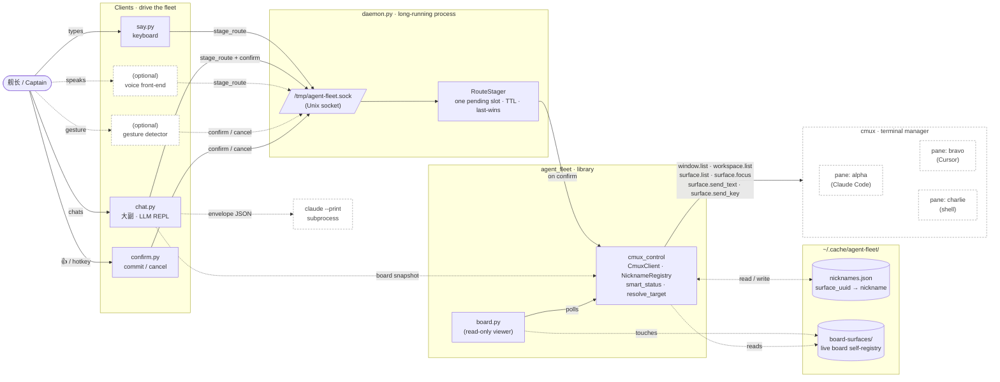
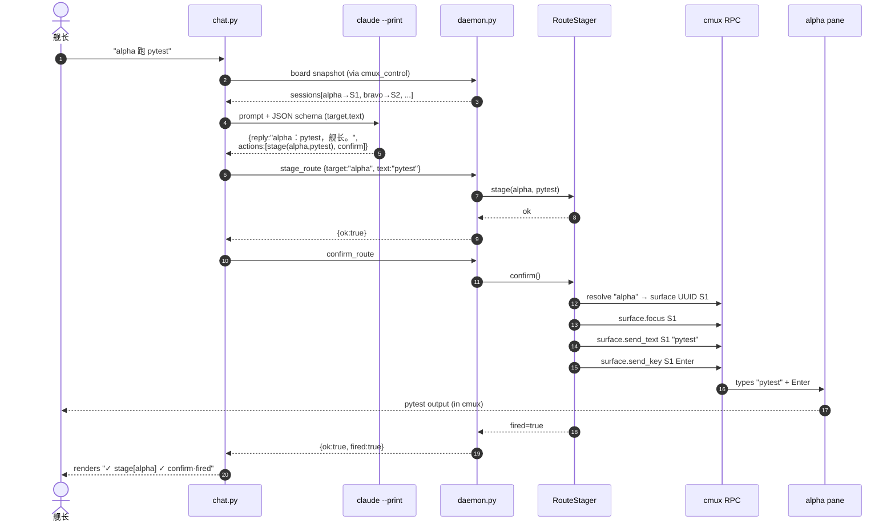
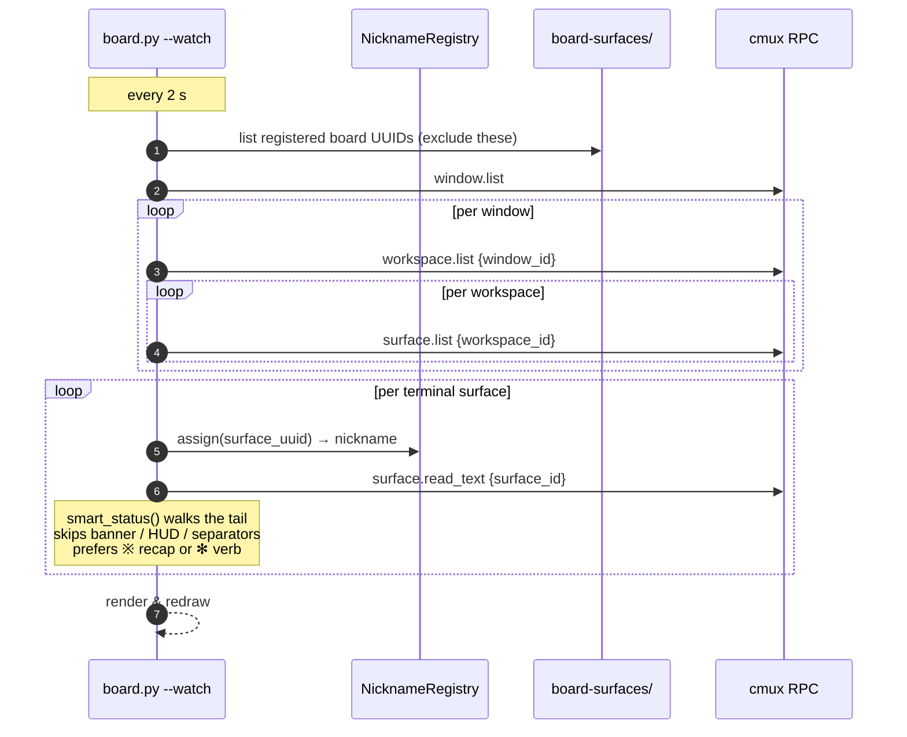

# agent-fleet architecture

agent-fleet is a tiny addressing + staging layer over [cmux](https://github.com/manaflow-ai/cmux):
it gives every terminal pane a stable nickname, holds at most one staged
command in a long-running daemon, and routes the verbatim command into the
chosen cmux pane on the captain's confirm. Clients (keyboard / LLM REPL /
voice / gesture) all speak the same newline-JSON socket protocol — anything
that can open a Unix socket is a valid driver.

The whole system is ~7 small modules. The diagrams below show how they fit.

> 📐 **Editable / higher-fidelity versions** of all three diagrams live as
> Excalidraw source files in [`diagrams/`](diagrams/) — drag any
> `.excalidraw` file into <https://excalidraw.com> to view or remix.
> Run [`diagrams/generate.py`](diagrams/generate.py) to regenerate after
> layout tweaks.

## System view

The dashed edges are optional / out-of-process. Solid boxes are agent-fleet
itself; everything outside `Clients` + `Daemon` + `Lib` is either user-owned
state or an external system (cmux, the LLM subprocess).

## Stage → confirm → execute (one full order)

The **stage → confirm split is the safety gate**: `stage_route` records intent
but sends nothing; only `confirm_route` actually types into the pane. A
pending command auto-expires after `RouteStager.ttl_s` (default 60 s), so a
stale stage can never fire much later. Captain can also drop it with
`cancel_route` from anywhere (👎 gesture, `confirm.py cancel`, REPL).

The captain can skip the LLM entirely — `say.py` runs the same protocol with
a deterministic regex parser, no `claude --print` subprocess, no spinner.

## Board read loop (read-only side path)

Two things this diagram makes explicit:

1. **Cross-window fanout.** `workspace.list` without `window_id` only returns
   the *caller's* window. The watcher iterates `window.list` first so popping
   the board into its own cmux window doesn't hide agent panes.
2. **Self-exclusion.** Each `board.py --watch` instance writes its own
   surface UUID to `~/.cache/agent-fleet/board-surfaces/<uuid>` on start
   (and removes it on clean exit via `atexit`). The watcher reads that
   directory each pass and skips those surfaces — the board never lists
   itself, no matter how cmux mangles the pane title.

## Wire protocol

Newline-delimited JSON over the Unix socket (default `/tmp/agent-fleet.sock`,
override with `AGENT_FLEET_SOCKET`). One request, one response, connection
closed.

| Action          | Request                                                    | Response                              |
| --------------- | ---------------------------------------------------------- | ------------------------------------- |
| `stage_route`   | `{action, target, text}` — `target` is nickname / prefix / int | `{ok: true}` or `{ok:false, error}`   |
| `confirm_route` | `{action}`                                                 | `{ok: true, fired: bool}`             |
| `cancel_route`  | `{action}`                                                 | `{ok: true, fired: bool}`             |

`fired:false` from confirm/cancel means there was nothing pending (TTL
expired, or it was already confirmed/cancelled by another client).

Legacy clients may still send `{action: "stage_route", session: int, text}`.
The daemon falls back to `session` when `target` is absent so the older
voice-hook / pre-nickname `say.py` keep working through the migration.

## Where state lives

| Location                                          | Lifetime           | Holds                                                                 |
| ------------------------------------------------- | ------------------ | --------------------------------------------------------------------- |
| `~/.cache/agent-fleet/nicknames.json`             | persistent         | `surface_uuid → nickname` (never recycled within a registry)          |
| `~/.cache/agent-fleet/board-surfaces/<uuid>`      | live-pane lifetime | empty marker file per running `board.py --watch` instance             |
| `/tmp/agent-fleet.sock`                           | daemon lifetime    | the broker's listen socket                                            |
| `RouteStager._pending` (in-memory)                | ≤ `ttl_s`          | the one staged `(target, text, staged_at)`                            |
| `chat.py` `ChatState` (per REPL session)          | REPL lifetime      | recent turns + last envelope + last action results                    |
| cmux itself                                       | (out of scope)     | windows, workspaces, surfaces, pane stdout/stdin — the real substrate |

## Concurrency model

- `RouteStager` is **thread-safe by `threading.Lock`**. `stage()` and
  `cancel()` mutate under the lock; `confirm()` takes-and-clears the pending
  slot under the lock, *then* runs the (blocking) cmux send action with the
  lock released. This means a concurrent `stage`/`cancel` is never blocked
  on a slow subprocess, and `route_fn` may safely re-enter the stager.
- The daemon runs `confirm`'s blocking cmux send via
  `loop.run_in_executor(None, …)` so the asyncio event loop is never stalled
  while cmux types characters into a pane.
- The daemon is single-process and accepts one connection at a time per
  client — clients are short-lived (request/response/close), so there's
  no long-poll fanout to worry about.

## Extension points

Adding a new client = open the Unix socket and write one JSON line. No SDK,
no schema generation. Examples:

- **Voice front-end (Web Speech / Whisper / Agora ConvoAI)**: transcribe →
  parse "alpha 跑 pytest" → POST `stage_route` → 👍 / `confirm`.
- **Gesture front-end (camera + thumbs detector)**: write `confirm` on 👍,
  `cancel` on 👎. No knowledge of cmux or nicknames needed.
- **Different LLM backend in chat.py**: swap the single `_call_claude`
  function (subprocess to `claude --print`) for any HTTP client that
  produces the same `{reply, actions[]}` envelope.
- **Different terminal manager**: replace `CmuxClient`. As long as it can
  enumerate "ships" with stable UUIDs and send text + Enter to a chosen one,
  the rest of the stack is unchanged.

## What agent-fleet deliberately does NOT do

- **No keystroke synthesis at the OS level.** Routing is done via cmux's
  RPC — typing into one pane never leaks to whichever window is in front.
  This is the whole reason we don't use AppleScript / Quartz.
- **No exec policy.** It types whatever text it's given; the captain decides.
  Confirm-gating is the only safety, and that's the captain's job.
- **No history or replay.** `RouteStager` holds at most one pending command;
  past stages aren't logged or recoverable.
- **No multi-user / remote.** The socket is `0o600` for the local user.
  Remote drivers should run their own bridge.
